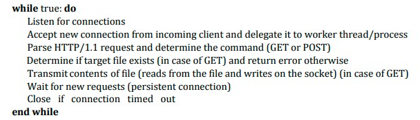
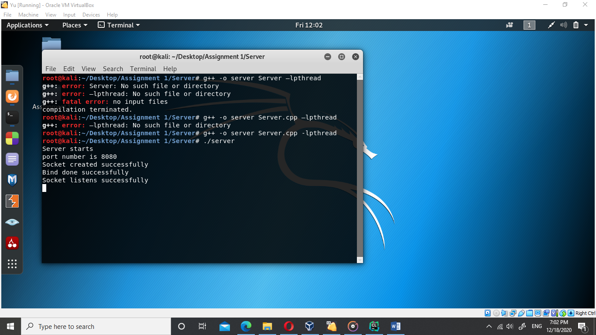
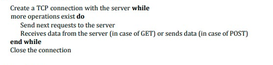
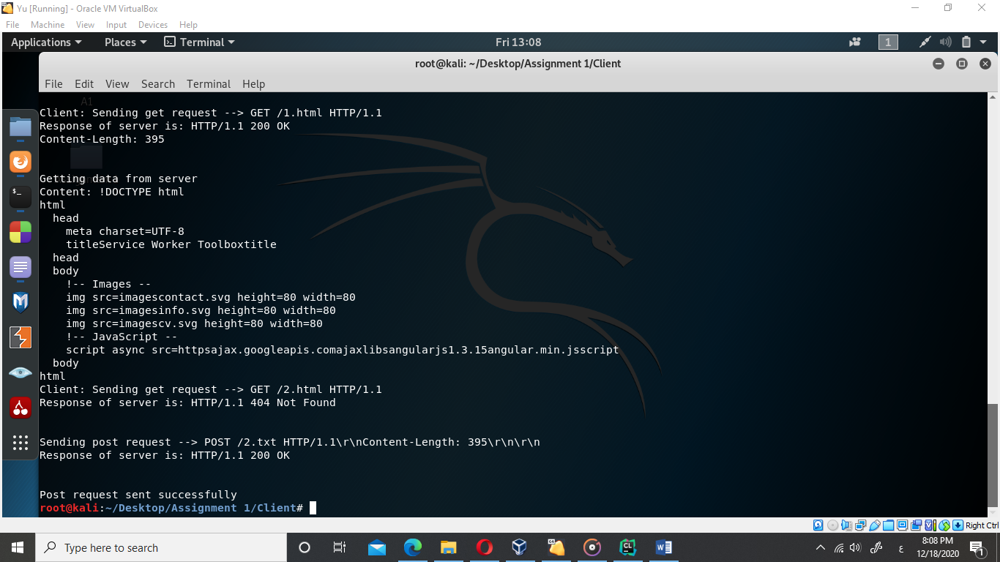
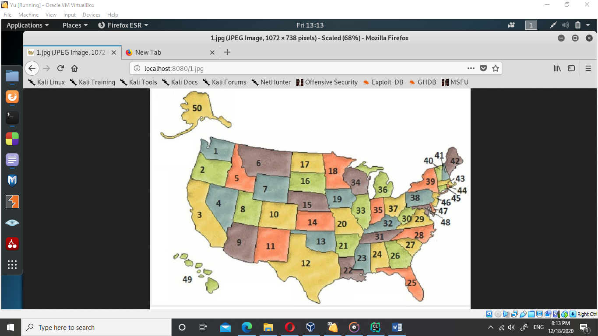
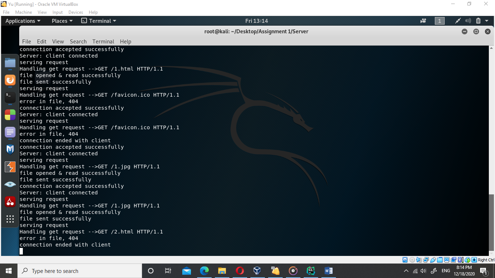

NETWORKS
ASSIGNMENT 1 
**18/12/2020**

# **Multi-threaded-Web-Server-HTTP-Web-Client**
Using sockets to implement a simple web client that communicates with a web server using a restricted subset of HTTP. The main objective of that is to give hands-on experience with UNIX sockets.

# **MULTI-THREADED WEB SERVER**
## **Main Algorithm** 

## **Functions used**
`    `**void init\_server(int port);**

Starting server with current port “default is 8080”, Create socket, bind it and start listing for clients, each client enter creates new thread to process requests.

`    `**static void \*req(void \* cs);**

function run to process requests, it recaved requests, separate them, and if it is get request send it to the function, if post request send to its function.

`    `**static bool is\_closed(int sock);**

check wither socket is closed or not.

`    `**static vector<string> split (string str, string token);**

take String and split it in certain token.

`    `**static void get\_request(string, int);**

get certain file from server, open it and send it to socket.

`    `**static void post\_request(vector<string>, int);**

read data from socket and save it to file.

`    `**static int get\_len( string str);**

get content length from response message.

## **Runs**
g++ -o server Server.cpp -lpthread
./server

# **HTTP WEB CLIENT**

## **Main Algorithm** 

## **Functions used**
`    `**void init\_client (int port, string hostname, string requests);**

Starting client connection to current port “default is 8080”, Create socket, bind it and start reading requests from file and check if get request call get\_request(), post request post\_request().

`    `**void get\_request (string, int);**

send get request, take response, if it’s 200 OK take the file and store it.

`    `**void post\_request (string, int);**

Read file then send post request with content length, after take response of server send the file.

`    `**vector<string> split (string str, string token);**

take String and split it in certain token.

`    `**int get\_len (string str);**

get content length from response message.
## **Runs**
g++ -o client Client.cpp –lpthread
./client

On Server 

# **BONUS**

1. ## **Test your server with a real web browser**
<http://localhost:8080/1.jpg> then <http://localhost:8080/2.html> , first file exist, Second not exist 

On Server

